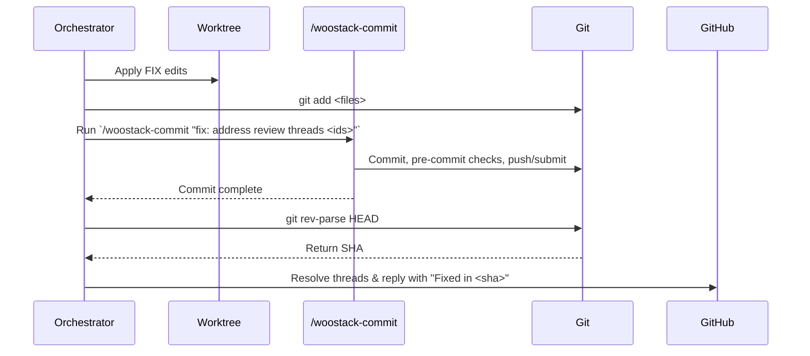

# woostack-address-comments: integrate the commit skill — Design Spec

> Visualize on demand: render this file with [spec-template.html](../../skills/woostack-build/references/spec-template.html) for a rich view, or hand it to `woostack-visualize` (audience `engineer`). Markdown is the source of truth; the HTML is a presentation target only.

> `status:` is the build-loop phase enum: `draft → hardened → approved → planning → executing → in-review → done` (plus the terminal `abandoned`). The build loop authors each transition and `/woostack-status` reads it; the enum and join contracts are defined once in [conventions.md](../../skills/woostack-status/references/conventions.md).

## 1. Problem

Currently, `woostack-address-comments` performs raw git commits and pushes directly when applying `FIX` edits to a PR. This duplicates commit logic, bypasses the user's `.woostack/config.json` pre-commit commands, bypasses Graphite integration (e.g. `gt submit` or branch stack management), and fails to update the PR body metadata (Goal, Summary, Test plan) that `woostack-commit` updates when new code is committed.

At the same time, `woostack-address-comments` needs to know the exact commit SHA of the fix to post precise replies on GitHub (e.g., `"Fixed in <sha>"`). Simply calling `woostack-commit` must be done in a way that allows the orchestrator to capture this SHA.

## 2. Goal

Integrate the `woostack-commit` skill into `woostack-address-comments` for committing, pushing, and updating PR metadata, while ensuring the orchestrator can still capture the commit SHA.

Concretely:
- Replace raw git commit/push instructions in `SKILL.md` and `prompts/address.md` with instructions to invoke `/woostack-commit` with a message referencing the threads.
- Instruct the agent to capture the resulting commit SHA using `git rev-parse HEAD` immediately after invoking `/woostack-commit`, using that SHA in GitHub thread replies.
- Ensure all existing tests in `skills/woostack-address-comments/scripts/tests/` continue to pass.

## 3. Non-goals

- We do not modify `woostack-commit` itself.
- We do not change other skills in the repository.
- We do not merge branches.

## 4. Approach

1. **Modify SKILL.md**: Update Step 5 of the "Workflow" section to stage changes, invoke `woostack-commit` with a message referencing the addressed threads, and capture the commit SHA.
2. **Modify prompts/address.md**: Update Step 1 under "After the phases" to explicitly command the agent to stage the changes and invoke `/woostack-commit "fix: address review threads <ids>"`, then run `git rev-parse HEAD` to capture the SHA.
3. **Verify Tests**: Ensure the existing test suite passes and that the worker contract tests (asserting workers do not commit/push) are unaffected since only the parent orchestrator invokes the commit skill.

## 5. Components & data flow

No new scripts or components are created. The orchestration of git commits and pushes is routed through `/woostack-commit` instead of executing raw commands directly.



## 6. Error handling

If the pre-commit hook or any check inside `/woostack-commit` fails, it exits non-zero. The orchestrator will halt immediately before posting any replies or resolving threads on GitHub, preventing the remote state from drifting.

## 7. Acceptance criteria

- **AC1 — SKILL.md updates**
  - happy: `skills/woostack-address-comments/SKILL.md` instructs the orchestrator to stage changes and invoke the `woostack-commit` skill, then capture the SHA.
- **AC2 — Prompt updates**
  - happy: `skills/woostack-address-comments/prompts/address.md` instructs the agent to run `/woostack-commit "fix: address review threads <ids>"` and run `git rev-parse HEAD` to capture the SHA.
- **AC3 — Test suite execution**
  - happy: The test files in `skills/woostack-address-comments/scripts/tests/` pass successfully.

## 8. Testing

Run the local test scripts to ensure syntax and assertions pass:
```bash
./skills/woostack-address-comments/scripts/tests/test-address-helper-scripts.sh
./skills/woostack-address-comments/scripts/tests/test-address-worker-contract.sh
./skills/woostack-address-comments/scripts/tests/test-address-comments-ownership.sh
```

## 9. Open questions

None.
