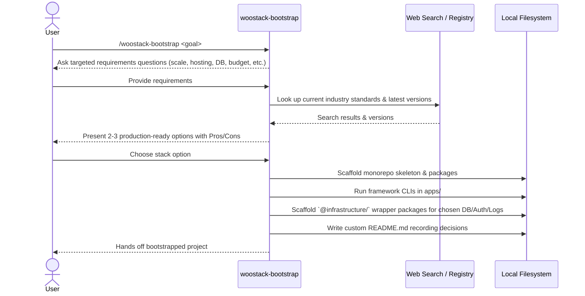

# Dynamic, Requirements-Driven `woostack-bootstrap` Skill — Design Spec

> Visualize on demand: render this file with [spec-template.html](../../skills/woostack-build/references/spec-template.html) for a rich view, or hand it to `woostack-visualize` (audience `engineer`). Markdown is the source of truth; the HTML is a presentation target only.

> `status:` is the build-loop phase enum: `draft → hardened → approved → planning → executing → in-review → done` (plus the terminal `abandoned`). The build loop authors each transition and `/woostack-status` reads it; the enum and join contracts are defined once in [conventions.md](../../skills/woostack-status/references/conventions.md).

## 1. Problem

Currently, the `woostack-bootstrap` skill assumes a specific, hardcoded default stack: Next.js, Expo, Hono, oRPC, Supabase (Postgres, Auth, Storage), Tailwind CSS, Stripe, Resend, and Axiom. 

While this is a solid stack for many projects, it has several limitations:
1. **Prescriptive and Inflexible**: It forces a single architecture on every greenfield project. If a project requires a Python/FastAPI backend, a SQL Server database, a traditional VPS/AWS deployment, or Cognito for auth, the skill cannot accommodate it.
2. **Lack of Dynamic Requirements Mapping**: It does not evaluate the user's specific goals and requirements (e.g., scaling needs, compliance constraints, legacy integrations, team familiarity, budget) to recommend the best tools.
3. **Drift in "Default" Gotchas**: Hardcoding details of specific versions of third-party tools in core reference documents makes them rotate out of date and leads to maintenance overhead.

## 2. Goal

Make the `woostack-bootstrap` skill completely generic, interactive, and requirements-driven. 

Concretely:
1. **Remove hardcoded default stacks** from the primary reference files as prescriptive defaults.
2. **Implement a dynamic requirements gathering and selection protocol**:
   - The user inputs a goal (e.g., `/woostack-bootstrap a data-heavy analytics dashboard with high security`).
   - The agent asks targeted questions to discover technical constraints and requirements.
   - The agent uses web search to lookup industry-standard frameworks, services, and their latest versions.
   - The agent presents 2-3 cohesive, production-ready stack options with a pros/cons comparison.
   - The user selects or refines their choice.
3. **Provide general instructions for Monorepo Slice Architecture**:
   - Generalize the app, feature, and infrastructure package slice rules to fit any technologies.
   - Standardize how components (e.g., database clients, auth SDKs, logging) are wrapped inside `@infrastructure/` packages and consumed by features/apps.
4. **Generalize production-readiness patterns** (CI/CD, env vars, database migrations, security) so they apply to any selected stack.

## 3. Non-goals

- We do not change the package import hierarchy (`Apps -> Features -> Infrastructure`).
- We do not change the `spec : plan : PRs = 1 : 1 : N` invariant.
- We do not build a separate automated registry scraper API; the agent handles lookup via normal tool execution (`run_command` with registry CLIs, or `search_web`).

## 4. Approach

### A. Restructure `skills/woostack-bootstrap/SKILL.md`
- Remove the hardcoded "Default stack" table.
- Update the Procedure section to:
  1. Gather project goals and requirements via interactive questions (Option 1).
  2. Research latest versions and industry standards based on these requirements.
  3. Formulate and present 2-3 stack options with detailed Pros/Cons, costs, and production readiness.
  4. Scaffolding based on the selected option.
- Re-map references to point to generalized files.

### B. Update `references/decisions.md`
- Remove references to Supabase, Vercel, Stripe, Axiom as default choices.
- Structure it as a questionnaire guide for the agent:
  - Questions to ask (scale/traffic patterns, database type, hosting preferences, compliance/security, external integrations, budget).
  - Protocol for researching and presenting stack options.
  - Recording the final decisions in the project-local `README.md`.

### C. Update `references/bootstrap.md`
- Generalize the steps to work with *any* stack:
  1. Determine the exact CLI bootstrap commands for the chosen stack (e.g. `npx create-next-app`, `cargo new`, `django-admin startproject`, `uv venv`).
  2. Map these CLI-generated apps to the `apps/` directory and workspaces.
  3. Clean up generic boilerplate generated by the CLIs.
  4. Scaffold infrastructure wrappers for the selected DB/Auth/Logging.
  5. Setup root level workspace files (`pnpm-workspace.yaml`, `turbo.json`, `package.json`, etc.) dynamically based on the chosen technologies.

### D. Update `references/architecture.md`
- Maintain the strict import direction (`Apps -> Features -> Infrastructure`).
- Generalize the description of `@infrastructure/` packages. Instead of hardcoding `@infrastructure/api-client` (oRPC) or `@infrastructure/flags` (Vercel Flags), describe how to create infrastructure wrappers for *any* selected auth provider, database connector, or external API client.
- Maintain the internal feature slice layout (`contracts/`, `routers/`, `procedures/`, `components/`, `surfaces/`, `layouts/`, `schemas/`), clarifying how custom API/routing frameworks fit into these directories.
- Add guidance for multi-language monorepos: non-JS/TS services (e.g., Python, Go, Rust) reside in `apps/<name>` or `packages/features/<name>` and use their native package managers (e.g. `uv`, `go mod`, `cargo`). Turborepo's `turbo.json` is configured to orchestrate builds, tests, and formatting across all language folders in the workspace.

### E. Update `references/frameworks.md`
- Shift focus from list of Next.js/Expo packages to:
  - Version-resolution guidelines (querying registries, checking peer dependency compatibility).
  - Guidelines for populating and maintaining a shared dependency catalog in monorepos.
  - Universal package-agnostic guidelines (e.g. peer-dependency alignment, monorepo import path mapping, native module constraints).
- Remove all framework-specific gotchas entirely. The agent will rely on live lookup, peer-dependency validation during research, and dynamic build-time debugging to resolve framework-specific compile errors and issues.

### F. Update `references/infrastructure.md`
- Provide generic, stack-agnostic guidelines for:
  - **Hosting & Deployment**: Designing containerized vs. serverless vs. VPS setups.
  - **Data Layer & Migrations**: Guidelines for running schema migrations (committed under version control) for SQL or NoSQL databases.
  - **Environment Variables**: Best practices for env storage, local `.env.example` templates, and env runtime validation.
  - **CI/CD**: Defining the standard PR pipeline (lint, build, test) using GitHub Actions generically.
  - **Observability**: Patterns for wrapping error trackers and loggers in an `@infrastructure/observability` package.

## 5. Components & data flow

## 6. Error handling

- **Version Lookup Failure**: If registry query fails, fall back to the most recent known LTS or stable version returned via web search.
- **CLI Bootstrapping Errors**: If a framework CLI fails or fails to compile in a monorepo setup, debug using `woostack-debug` to adjust package exports and tsconfig files.
- **Incompatible peer dependencies**: The agent must run `npm view` or check dependency graphs during research to ensure chosen layers work together before suggesting options.

## 7. Acceptance criteria

- **AC1 — Dynamic Bootstrap Skill Definition**
  - happy: `skills/woostack-bootstrap/SKILL.md` is updated to define the dynamic requirements-gathering and options-presentation procedure, removing the static default stack table.
- **AC2 — Decisions Questionnaire & Options Protocol**
  - happy: `references/decisions.md` outlines how to ask the user about requirements, research options, present pros/cons, and record choices in the project `README.md`.
- **AC3 — Generalized Scaffolding Guide**
  - happy: `references/bootstrap.md` details how to bootstrap arbitrary frameworks using standard CLIs and wire them into `apps/`, `packages/features/`, and `packages/infrastructure/`.
- **AC4 — Package Slice Architecture Adaptation**
  - happy: `references/architecture.md` defines the import direction (`Apps -> Features -> Infrastructure`) and how custom framework components (e.g. custom routers, DB connectors) map to these folders.
- **AC5 — Live Version Resolution Guidelines**
  - happy: `references/frameworks.md` defines version resolution procedures and dependency cataloging standards for any custom stack.
- **AC6 — Stack-Agnostic Infrastructure Patterns**
  - happy: `references/infrastructure.md` details how to set up CI/CD, database migrations, env variable templates, and observability wrappers for any chosen stack.

## 8. Testing

- Verify that all modified files in `skills/woostack-bootstrap/` have no hardcoded assumptions that Vercel, Supabase, Stripe, Resend, or Axiom must be used.
- Verify that all relative links between the markdown files in `skills/woostack-bootstrap/references/` are fully functional and correct.

## 9. Open questions

None.
