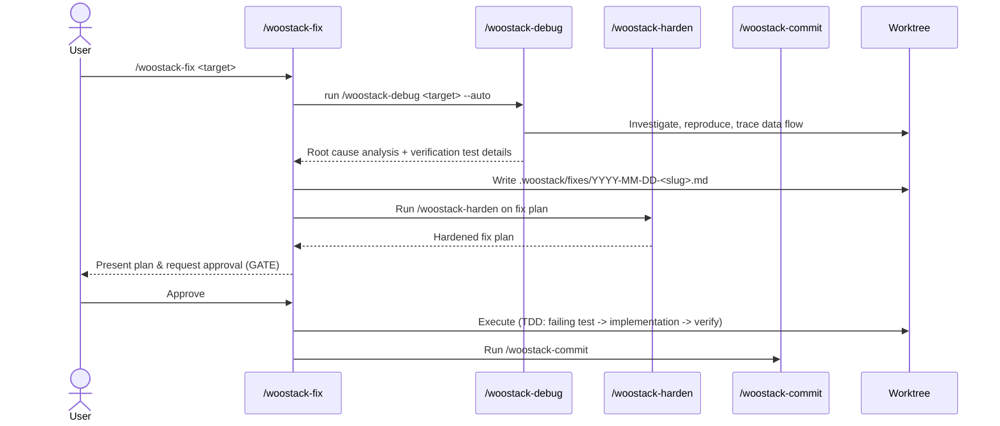

# Create `woostack-fix` Skill and Refine `woostack-debug` — Design Spec

> Visualize on demand: render this file with [spec-template.html](../../skills/woostack-build/references/spec-template.html) for a rich view, or hand it to `woostack-visualize` (audience `engineer`). Markdown is the source of truth; the HTML is a presentation target only.

> `status:` is the build-loop phase enum: `draft → hardened → approved → planning → executing → in-review → done` (plus the terminal `abandoned`). The build loop authors each transition and `/woostack-status` reads it; the enum and join contracts are defined once in [conventions.md](../../skills/woostack-status/references/conventions.md).

## 1. Problem

Currently, resolving technical issues (bugs, small improvements) uses either `woostack-build` or `woostack-debug`. This has two major issues:
1. **High Overhead**: The full `woostack-build` loop requires separate spec and plan files, multiple hardening rounds, a docs-only PR, and multiple execution branches. This is too heavy for small fixes.
2. **Responsibility Bleed**: The `woostack-debug` skill mixes root cause diagnosis with code modification/implementation (Phase 4). This violates the single-responsibility principle. Debugging should focus purely on *identifying and reproducing* the root cause, whereas code changes should go through a plan-approve-execute flow.

## 2. Goal

Introduce a new `woostack-fix` skill that coordinates bug fixing, and refine the `woostack-debug` skill to focus exclusively on diagnosing root causes.

Concretely:
1. **Refine `woostack-debug`**: Remove Phase 4 (Implementation) and code-modifying steps. Limit its scope to Phase 1 (Investigation), Phase 2 (Pattern Analysis), and Phase 3 (Hypothesis & Test with minimal reproduction).
2. **Create `woostack-fix`**: Implement a new public skill `/woostack-fix <target>` that:
   - Uses `woostack-debug` to identify a root cause.
   - Writes a unified "fix plan" under `.woostack/fixes/YYYY-MM-DD-<slug>.md`.
   - Runs `woostack-harden` on the fix plan.
   - Halts for explicit user approval before execution (the gate).
   - Executes the fix steps using TDD (test-first).
   - Commits the changes using `woostack-commit`.
3. **Update `woostack-init`**: Ensure `.woostack/fixes/` directory and `.gitkeep` are created and managed.
4. **Update `woostack-status`**: Scan `.woostack/fixes/*.md` and display active fixes on the feature board alongside features, prefixed with `[FIX]`.
5. **Update Routing**: Register `woostack-fix` as the 15th public skill in `using-woostack`, `AGENTS.md`, and `README.md`.

## 3. Non-goals

- We do not modify the core TDD doctrine (`woostack-tdd`).
- We do not change the core Obsidian memory/distillation scripts unless required.
- We do not merge PRs automatically.

## 4. Approach

### A. Debug Skill Refinement
- Edit `skills/woostack-debug/SKILL.md` to remove references to Phase 4 (Implementation), count of attempts, and escalation rules for 3+ failed fixes.
- Adjust the `--auto` description: `--auto` mode in `woostack-debug` will run Phases 1–3 autonomously (reproducing and tracing data flow) and print the root cause hypothesis and evidence without prompting the user. Standalone mode (no `--auto`) will stop after Phase 1 or 2 and ask the user for guidance or verify findings interactively.
- The Iron Law remains: **NO FIX WITHOUT ROOT CAUSE INVESTIGATION FIRST**.

### B. Fix Skill Creation
- Create `skills/woostack-fix/SKILL.md` defining the unified gated loop.
- Define a template for the fix plan stored at `.woostack/fixes/YYYY-MM-DD-<slug>.md`.
- Status enum transitions for fixes: `draft → hardened → approved → executing → in-review → done` (computed or written in frontmatter).

### C. Workspace & Status Updates
- Update `skills/woostack-init/SKILL.md` and templates to add `.woostack/fixes/`.
- Update `skills/woostack-status/scripts/status.sh` to:
  - Glob `.woostack/fixes/*.md` in addition to specs.
  - Parse frontmatter (`type: fix`, `status:`, `branch:`) and checklist items.
  - Render fixes in the status output with a `[FIX]` prefix.

### D. Routing Updates
- Update `skills/using-woostack/SKILL.md` Command Routing table.
- Update `AGENTS.md` and `README.md`.

## 5. Components & data flow

## 6. Error handling

- If `woostack-debug` fails to identify a root cause, `woostack-fix` halts and prompts the user for manual investigation hints.
- If execution verifications fail, the loop pauses and prompts the user or runs debug again on the new failure.

## 7. Acceptance criteria

- **AC1 — Debug skill refinement**
  - happy: `skills/woostack-debug/SKILL.md` contains no implementation (Phase 4) details, focusing purely on Phases 1-3.
- **AC2 — Fix skill definition**
  - happy: `skills/woostack-fix/SKILL.md` exists and defines the unified execution loop using `woostack-debug`, `woostack-harden`, and `woostack-commit`.
- **AC3 — Init integration**
  - happy: Running `/woostack-init` ensures `.woostack/fixes/` and its `.gitkeep` exist.
- **AC4 — Status integration**
  - happy: `status.sh` scans `.woostack/fixes/*.md` and prints them with a `[FIX]` prefix, calculating progress from their checklists.
- **AC5 — Workspace wiring**
  - happy: `using-woostack`, `AGENTS.md`, and `README.md` all list `/woostack-fix` and have consistent counts (15 public skills).

## 8. Testing

- Run `woostack-init` and verify `.woostack/fixes/` exists.
- Create a test fix plan at `.woostack/fixes/2026-06-08-test-fix.md` and check that `woostack-status` renders it correctly.
- Verify that `woostack-status` shows correct checklist counts (`N/M`) for the test fix plan.

## 9. Open questions

None.
