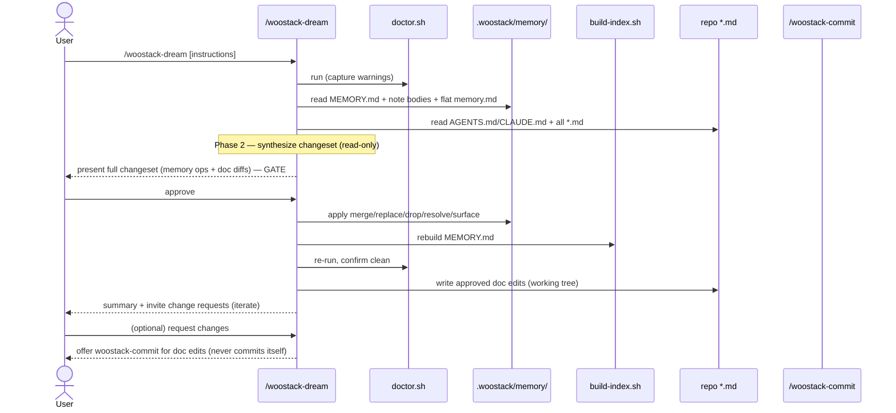

# Create `woostack-dream` Skill — Agent-Agnostic Memory & Docs Curation — Design Spec

> **Plan:** [[plans/2026-06-09-woostack-dream]]

> Visualize on demand: render this file with [spec-template.html](../../skills/woostack-build/references/spec-template.html) for a rich view, or hand it to `woostack-visualize` (audience `engineer`). Markdown is the source of truth; the HTML is a presentation target only.

> `status:` is the build-loop phase enum: `draft → hardened → approved → planning → executing → in-review → done` (plus the terminal `abandoned`). The build loop authors each transition and `/woostack-status` reads it; the enum and join contracts are defined once in [conventions.md](../../skills/woostack-status/references/conventions.md).

## 1. Problem

woostack agents write to the `.woostack/memory/` store incrementally as they work (distillation, accept-by-design review memory). Over many sessions that store accrues duplicates, near-duplicates phrased differently, stale entries scoped to deleted paths, and contradictory advice across overlapping scopes. `doctor.sh` already *detects* these structural signals (overlap clusters, stale provenance, orphaned scope, dead notes, missing provenance, trivia) but only **warns** — it never merges, rewrites, or drops anything, and it has no view into whether two co-loading notes actually contradict.

Separately, durable conventions that recur across many memory notes often belong **promoted into documentation** (`AGENTS.md`, `README.md`, guides) where every contributor sees them, not buried in a local-only memory store. And docs drift: a doc can assert something the memory store has since contradicted. Nothing in woostack closes either loop.

Anthropic's managed-agents "Dreams" feature solves the first half for hosted agents: it reads a memory store plus past session transcripts and produces a reorganized store (duplicates merged, stale entries replaced, new insights surfaced), non-destructively, for review. woostack has no agent-agnostic equivalent, and Dreams does not touch documentation.

## 2. Goal

Introduce a new public command skill, **`/woostack-dream [instructions]`**, that runs an agent-agnostic curation/reflection pass over the woostack knowledge store and:

1. **Curates memory in place** — merges duplicates/near-duplicates, replaces stale or contradicted notes with the latest value, drops dead and orphaned-scope notes, resolves overlap-cluster conflicts, and surfaces consolidated cross-note insights.
2. **Recommends documentation updates** — promotes recurring conventions from memory into repo docs and fixes doc claims the memory store now contradicts, scoped to **all repo markdown** but **gated on memory evidence** (a doc edit is proposed only where a specific memory note supports it).
3. **Gates every mutation behind explicit user approval** — nothing changes before the user approves the proposed changeset (faithful to Dreams' "input never modified; review the output").
4. **Ends with a summary and an iterate loop** — presents what changed and lets the user request further changes, applying adjustments until they are satisfied.

The skill is the agent-agnostic, lo-fi analog of Dreams: no async API, no managed sessions — it reflects over the *static* store and docs, deterministically and repeatably.

## 3. Non-goals

- **No session-transcript mining.** Unlike Dreams, `woostack-dream` does not consume past session transcripts or the current live conversation. Inputs are the static store + docs + git history only. (Resolved fork; see §4.)
- **No commit or merge.** Memory is local-only/gitignored (no commit). Doc edits land in the working tree only; `woostack-dream` offers `woostack-commit` but never commits, pushes, or merges itself.
- **No new memory script.** `woostack-dream` reuses the existing `woostack-init/scripts/` primitives (`doctor.sh`, `build-index.sh`, `recall.sh`, `scope-match.sh`); it adds no new script and does not change the memory contract or note schema.
- **No replacement of `doctor.sh`.** `doctor.sh` stays the mechanical lint; `woostack-dream` is the agentic synthesis + apply layer on top of its signals.
- **No replacement of the incremental writers.** `woostack-dream` is periodic garbage-collection; it complements — does not replace — the incremental write paths (`woostack-execute` distillation, `woostack-address-comments` memory-record).
- **No spec/plan/status reconciliation.** Drift between a spec's authored `status:` and its artifacts is `/woostack-status`'s job; `woostack-dream` touches only memory notes and docs.
- **Not part of the gated build chain.** It is a standalone maintenance command, not a `woostack-build` phase.

## 4. Approach

A new self-contained skill at `skills/woostack-dream/SKILL.md` plus the surface wiring to register it as the **sixteenth public command**. The skill body defines a five-phase pipeline.

### Phase 1 — Gather signals (read-only)
- Resolve the memory store. If `.woostack/memory/` exists, run `doctor.sh` (capture its warnings) and read `memory/MEMORY.md` + all note bodies. Always read the flat `memory.md` global shard. If only the flat file exists (no scoped store), **state the degradation explicitly** and curate the flat file alone — bullet-level dedupe/replace/drop, no scope/index/doctor machinery (memory contract §10).
- Read `AGENTS.md`/`CLAUDE.md` and enumerate the doc-recommendation surface as **tracked** markdown via `git ls-files '*.md'` (so gitignored memory and `node_modules` are never targets). Exclude `.woostack/specs|plans|fixes/*.md` from the *promotion-target* set — those are curation inputs (provenance), not docs to promote conventions into.
- Read recent `git log` and the `.woostack/specs|plans|fixes/` artifacts a note's `source:` points at, to ground "stale vs. current" judgments in provenance.
- Honor an optional free-text `instructions` argument that steers focus (e.g. `"focus on API conventions; ignore one-off gotchas"`) — applied throughout synthesis, like Dreams' `instructions`.

### Phase 2 — Synthesize (the "dream", read-only)
Agent judgment layered on doctor's signals, producing a proposed changeset of discrete, labeled ops:
- **Merge** — duplicate or fuzzy-near-duplicate notes (matching hooks/bodies) collapse into one denser note; the survivor keeps the union of scopes and the most specific provenance. **Link integrity:** inbound `[[wikilinks]]` to a merged-away note (found via `graph.sh --backlinks`) are rewritten to the survivor in the same changeset, so `doctor.sh`'s unresolved-link check stays clean post-apply.
- **Replace** — a note contradicted by a newer note or by current code/provenance is rewritten to the latest value, preserving `source:`.
- **Drop** — dead notes (old + never recalled, per `doctor.sh`'s dead-note signal) and orphaned-scope notes (scope matches no tracked file) are proposed for deletion with the reason. Inbound links are rewritten or removed as for merge. **Because the memory store is gitignored, a dropped note is unrecoverable** — so the gate (Phase 3) must show the *full body* of every note proposed for deletion, giving the user a chance to salvage it.
- **Resolve conflict** — for each `doctor.sh` overlap cluster, the agent judges whether the co-loading notes actually contradict; if so it picks the correct note and records why the other is superseded. **When the agent cannot confidently adjudicate** (genuine ambiguity needing domain knowledge), it does **not** guess — it surfaces the conflicting notes as a flagged decision for the user to resolve at the gate.
- **Surface** — a recurring pattern spread across several notes is proposed as one new consolidated note. Its `source:` is **derived from the contributing notes' provenance, never fabricated**, and it must pass the distillation reject-by-default gate of memory contract §7 (glob scope, provenance, dedupe, `updated:` stamp).
- **Doc recommendation** — where a memory note evidences a convention worth promoting, or contradicts a doc claim, propose the specific doc edit. **Evidence guard:** every proposed doc edit cites the memory note(s) backing it; no note → no doc edit. This keeps the broad "all repo markdown" scope high-signal.

The pass is **idempotent**: run twice with no intervening work, the second run finds nothing to curate (no ghost merges, no re-proposed drops).

### Phase 3 — Review gate (HARD)
Present the complete changeset as a reviewable before/after: each memory op (merge/replace/drop/resolve/surface) with the affected note(s), each **drop showing the full note body** (unrecoverable once applied), each **un-adjudicated conflict flagged for the user to decide**, and each doc edit as a diff with its backing note cited. **Nothing has mutated yet.** Require explicit approval before applying. Honor `honor-approval-gates` — silence or ambiguity is not approval. For a large changeset, offer a `woostack-visualize` render (audience `engineer`) as a reading aid; the changeset still lives in the conversation, not a separate artifact.

### Phase 4 — Apply (on approval)
- Memory: rewrite/delete the affected note files in place, then run `build-index.sh` to regenerate `MEMORY.md`, then re-run `doctor.sh` and confirm it is clean (or report any residual warnings).
- Docs: write the approved doc edits into the working tree (uncommitted).

### Phase 5 — Summarize & iterate
Present a final summary (notes merged/replaced/dropped/added, conflicts resolved, doc edits applied). Invite change requests; on a request, return to Phase 3/4 for the adjustment and re-summarize. When done: memory changes are already local-only (no commit needed); for the working-tree doc edits, offer to hand off to `woostack-commit`. `woostack-dream` never commits or merges itself.

### Surface wiring
- `skills/using-woostack/SKILL.md` — add the `/woostack-dream` Command Routing row.
- `AGENTS.md` (= `.claude/CLAUDE.md` symlink) — add `woostack-dream` to the public command list (fifteen → sixteen), the Quick file map, and Mode B's command enumeration.
- `README.md` — add `woostack-dream` wherever the public commands are listed, keeping any count consistent.

## 5. Components & data flow

## 6. Error handling

- **No `.woostack/` at all** — state that there is no memory store to curate and stop; do not scaffold (defer to `/woostack-init`).
- **Scripts missing** (skill installed individually, not full collection) — follow the memory contract §10 degradation: announce manual fallback, do the recall/lint by hand, never fail silently.
- **`doctor.sh` exits non-zero** (hard errors, not warnings) — surface the errors and continue the read; do not let a lint error abort the curation pass.
- **Empty / clean store** — if synthesis finds nothing to change and no doc edits are warranted, report "nothing to curate" and stop without a gate.
- **Post-apply `doctor.sh` still warns** — report the residual warnings in the summary rather than silently swallowing them. In particular, an unresolved-`[[wikilink]]` warning after apply means a merge/drop missed an inbound link — flag it for follow-up.
- **No approval** — never apply. Re-present or exit on the user's choice.

## 7. Acceptance criteria

- **AC1 — Skill definition & pipeline**
  - happy: `skills/woostack-dream/SKILL.md` exists with valid frontmatter (`name: woostack-dream`, a discovery-oriented `description`) and defines the five phases (gather → synthesize → gate → apply → summarize/iterate).
  - edge: the optional `instructions` argument is documented as steering synthesis focus.
- **AC2 — Hard gate / non-destructive**
  - happy: the skill states no memory note or doc is mutated before explicit approval, and references `honor-approval-gates`.
  - error: ambiguous/no answer is explicitly not treated as approval.
- **AC3 — Memory curation ops**
  - happy: the skill enumerates merge / replace / drop / resolve-conflict / surface, each tied to a `doctor.sh` signal where applicable.
  - happy: after apply, the skill runs `build-index.sh` then re-runs `doctor.sh` to confirm clean.
  - edge: new "surface" notes must pass the memory-contract §7 distillation reject-by-default gate (glob scope, provenance, dedupe, `updated:` stamp).
- **AC4 — Doc recommendations (evidence-guarded)**
  - happy: doc scope is all repo `*.md`; each proposed doc edit cites the backing memory note(s).
  - error: a candidate doc edit with no backing memory note is not proposed.
- **AC5 — Degradation**
  - happy: with a scoped store, the skill uses `doctor.sh`/`build-index.sh`/`recall.sh`.
  - edge: with only flat `memory.md` (no scoped store), the skill states the fallback and curates the flat file; with no `.woostack/` it stops without scaffolding.
- **AC6 — No commit / no merge**
  - happy: memory changes are described as local-only; doc edits land in the working tree only; the skill offers `woostack-commit` and never commits, pushes, or merges.
- **AC7 — Surface wiring & consistent counts**
  - happy: `using-woostack` has a `/woostack-dream` routing row; `AGENTS.md`/`CLAUDE.md` lists it in the public command list, Quick file map, and Mode B; `README.md` lists it.
  - happy: every place that states the public-command count is updated from fifteen to sixteen and they agree.
- **AC8 — Summary & iterate loop**
  - happy: the skill ends by summarizing applied changes and inviting change requests, looping to apply adjustments before finishing.
- **AC9 — Link integrity & idempotency**
  - happy: merging or dropping a note rewrites/removes inbound `[[wikilinks]]` so post-apply `doctor.sh` reports no new unresolved links.
  - edge: a second `woostack-dream` run with no intervening work finds nothing to curate (idempotent).
  - edge: a note proposed for deletion is shown with its full body at the gate before it is removed.

## 8. Testing

> Strategy only — harness, test levels, fixtures, CI. Per-behavior cases live in §7.

This repo ships skill markdown, not application code, and has no app test runner or CI (per `AGENTS.md`). Per the `woostack-tdd` no-runner carve-out, verification is **concrete structural assertion** rather than red/green unit tests:

- **Existence & frontmatter** — `skills/woostack-dream/SKILL.md` exists with a valid `name`/`description` frontmatter block.
- **Cross-link integrity** — every relative link in the new SKILL.md (to `woostack-init` scripts, `woostack-commit`, the memory contract, `honor-approval-gates`, conventions.md) resolves to a real file.
- **Surface consistency (grep)** — `grep` confirms the `/woostack-dream` row in `using-woostack`, the entry in `AGENTS.md`'s command list/file map/Mode B, and the `README.md` listing; a count check confirms no remaining "fifteen"/"15 public" references where "sixteen"/"16" is now correct.
- **Live dry-run** — run `/woostack-dream` against this repo's own `.woostack/memory/` store and confirm: Phase 1 reads + `doctor.sh` runs, Phase 2 produces a labeled changeset, the gate halts before any mutation, and (on a test approval) `build-index.sh`/`doctor.sh` re-run clean. This doubles as the skill's own acceptance smoke test.

## 9. Open questions

**Settled during hardening:**
- Inbound `[[wikilink]]` integrity on merge/drop → rewrite/remove in the same changeset; `doctor.sh` unresolved-link check verifies (§4 Merge/Drop, AC9).
- Doc enumeration → `git ls-files '*.md'`, tracked-only; `.woostack/` spec/plan/fix markdown excluded as promotion *targets* (§4 Phase 1).
- Un-adjudicable overlap conflicts → flagged for the user at the gate, never auto-guessed (§4 Resolve).
- Dropped notes are unrecoverable (gitignored store) → gate shows full body before deletion (§3 Drop non-goal stake, §4 Phase 3, AC9).
- "Surface" note provenance → derived from contributing notes, never fabricated (§4 Surface).
- Idempotency → a re-run with no intervening work finds nothing (§4, AC9).
- Changeset presentation → **in conversation** (consistent with the ideate/harden/fix gates), optionally rendered via `woostack-visualize`; no separate candidate-store artifact, so no `woostack-init` change.

None open.
