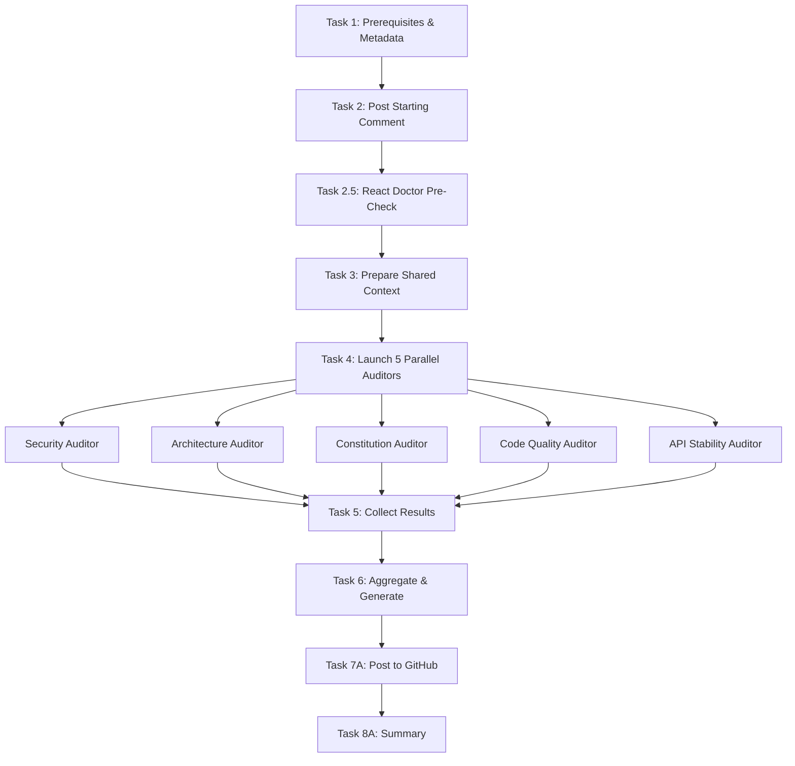
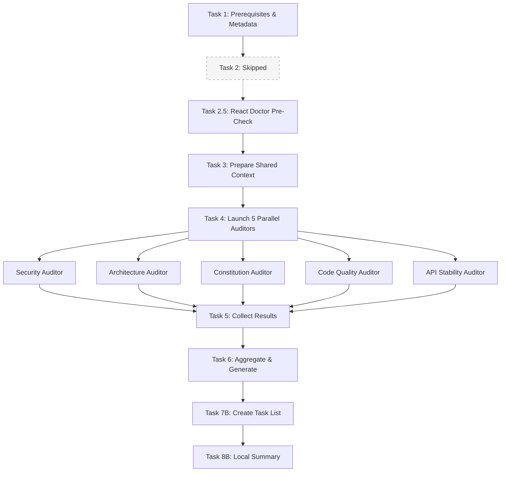
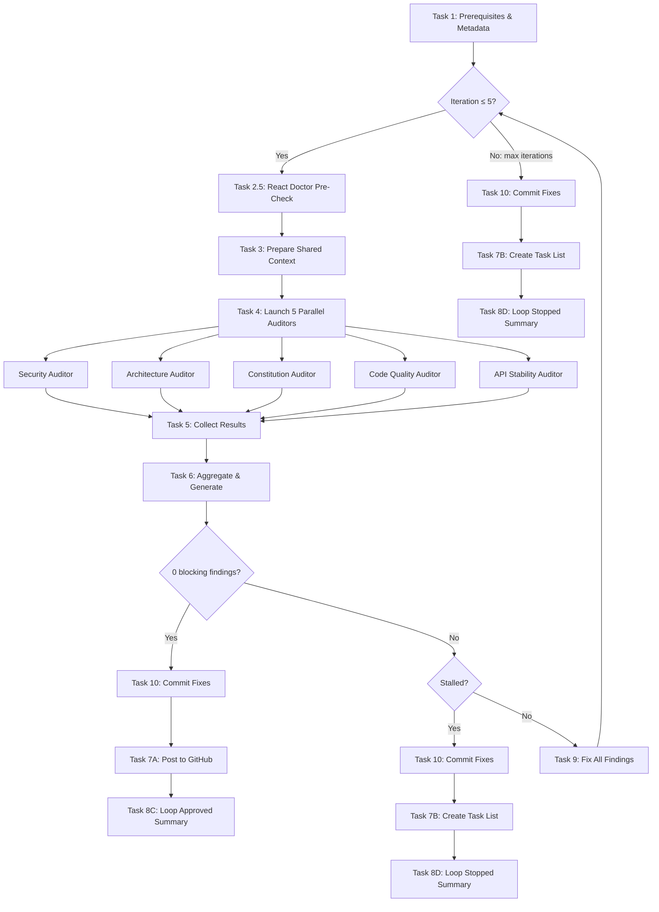

# React Doctor Integration Implementation Plan

> **For Claude:** REQUIRED SUB-SKILL: Use superpowers:executing-plans to implement this plan task-by-task.

**Goal:** Integrate react-doctor as a pre-check gate in the pr-review skill and a parallel CI job, removing overlapping React rules from the Code Quality Auditor.

**Architecture:** react-doctor runs as Task 2.5 before the 5 parallel auditors. Its diagnostics are converted to `AUDIT_FINDINGS` format and merged in Task 6 aggregation. In loop mode, Task 2.5 re-runs each iteration so the fix agent can resolve react-doctor errors. A separate CI job runs react-doctor on every PR via GitHub Actions.

**Tech Stack:** react-doctor CLI (`npx -y react-doctor@latest`), GitHub Actions (`millionco/react-doctor@main`)

---

### Task 1: Add react-doctor config file

**Files:**
- Create: `react-doctor.config.json`

**Step 1: Create the config file**

```json
{
  "ignore": {
    "rules": [],
    "files": [
      "packages/infrastructure/api-client/src/generated/**",
      "packages/infrastructure/supabase/src/generated/**"
    ]
  },
  "lint": true,
  "deadCode": false,
  "verbose": true,
  "diff": "main"
}
```

**Step 2: Commit**

```bash
git add react-doctor.config.json
gt modify -m "chore: add react-doctor configuration"
```

---

### Task 2: Strip React-specific rules from Code Quality Auditor

**Files:**
- Modify: `.claude/skills/pr-review/agents/code-quality-auditor.md:14,35-40,47-51,75,102`

**Step 1: Remove "God Components" from Complexity Issues (line 14)**

Replace lines 13-14:
```markdown
- **Too Many Parameters** - Functions with more than 5 parameters (use object parameter)
- **God Components** - React components doing too much (data fetching + state + UI + business logic)
```

With:
```markdown
- **Too Many Parameters** - Functions with more than 5 parameters (use object parameter)
```

**Step 2: Remove React-overlapping Performance Concerns (lines 37-40)**

Replace lines 35-40:
```markdown
### Performance Concerns
- **N+1 Query Patterns** - Fetching related data in loops
- **Missing Memoization** - Expensive computations without useMemo/useCallback
- **Unnecessary Re-renders** - Missing React.memo for pure components
- **Large Bundle Imports** - Importing entire libraries instead of specific modules
- **Missing Code Splitting** - Large components that should be lazy-loaded
```

With:
```markdown
### Performance Concerns
- **N+1 Query Patterns** - Fetching related data in loops
- **Large Bundle Imports** - Importing entire libraries instead of specific modules
```

**Step 3: Remove entire React-Specific Issues section (lines 47-51)**

Delete lines 47-51:
```markdown
### React-Specific Issues
- **Missing Keys** - Lists without proper key props
- **Inline Object/Function Props** - Creating new references on every render
- **State Management Issues** - Derived state that should be computed
- **Effect Dependencies** - Missing or incorrect useEffect dependencies
```

**Step 4: Remove `react` from Category enum (line 75)**

Replace line 75:
```markdown
- **Category**: [complexity|smell|error-handling|typescript|performance|testing|react]
```

With:
```markdown
- **Category**: [complexity|smell|error-handling|typescript|performance|testing]
```

**Step 5: Remove "Missing memoization" from severity guidelines (line 102)**

Replace line 102:
```markdown
- **MEDIUM**: Missing memoization, code smells, moderate complexity, missing tests
```

With:
```markdown
- **MEDIUM**: Code smells, moderate complexity, missing tests
```

**Step 6: Verify the file reads correctly**

Run: `Read .claude/skills/pr-review/agents/code-quality-auditor.md`

Verify: No React-specific items remain. Complexity, code smells, error handling, TypeScript quality, N+1 queries, large bundle imports, and testing gaps are still present.

**Step 7: Commit**

```bash
git add .claude/skills/pr-review/agents/code-quality-auditor.md
gt modify -m "refactor(pr-review): remove React rules from code quality auditor (delegated to react-doctor)"
```

---

### Task 3: Add Task 2.5 to WORKFLOW.md

**Files:**
- Modify: `.claude/skills/pr-review/WORKFLOW.md:1-3,4,54-55,80,108,110-155,782-870`

**Step 1: Update intro paragraph (line 1)**

Replace line 1:
```markdown
# PR Review Workflow

This document details the workflow for performing AI-driven code reviews with **parallel specialized auditors**. Standard and local modes execute all 8 numbered tasks (in local mode, Task 2 is skipped). Loop mode wraps Tasks 3-6 in an iteration loop with Task 9 (fix findings), commits fixes via Task 10, and routes post-loop output through Tasks 7-8.
```

With:
```markdown
# PR Review Workflow

This document details the workflow for performing AI-driven code reviews with **react-doctor pre-check** and **parallel specialized auditors**. Standard and local modes execute all numbered tasks (in local mode, Task 2 is skipped). Loop mode wraps Tasks 2.5-6 in an iteration loop with Task 9 (fix findings), commits fixes via Task 10, and routes post-loop output through Tasks 7-8.
```

**Step 2: Update task count reference (line 12)**

Replace line 12:
```markdown
- **Complete all 8 tasks** in sequence without stopping (in local mode, Task 2's posting step is skipped)
```

With:
```markdown
- **Complete all tasks** in sequence without stopping (in local mode, Task 2's posting step is skipped)
```

**Step 3: Update task note (lines 54-55)**

Replace lines 54-55:
```markdown
> **Note:** Tasks 1, 3-6 execute identically in both modes. Tasks 2, 7, and 8 have mode-specific behavior (Task 2 is skipped in local mode).
```

With:
```markdown
> **Note:** Tasks 1, 2.5, 3-6 execute identically in both modes. Tasks 2, 7, and 8 have mode-specific behavior (Task 2 is skipped in local mode).
```

**Step 4: Insert Task 2.5 after Task 2 (after line 107)**

Insert after line 107 (`---`):

````markdown

### Task 2.5: React Doctor Pre-Check

Run react-doctor to scan changed files for React-specific issues. This task runs in **all modes** (standard, local, loop).

**Step 2.5.1: Run react-doctor**

Run this command (replace `<BASE_BRANCH>` with the base branch from Task 1 metadata):

```bash
npx -y react-doctor@latest . --verbose --diff <BASE_BRANCH> --no-dead-code --no-ami 2>&1 || true
```

Note: The `|| true` ensures the workflow continues regardless of react-doctor's exit code. We parse the output ourselves.

**Step 2.5.2: Parse output**

Extract from the react-doctor output:
- **Score**: The 0-100 health score (look for `Score: XX/100` or similar)
- **Diagnostics**: Each diagnostic has: file path, rule name, severity (`error` or `warning`), message, line number, column number

**Step 2.5.3: Convert diagnostics to AUDIT_FINDINGS format**

Convert each react-doctor diagnostic into the standard finding format:

```
---AUDIT_FINDINGS---
AGENT: react-doctor
FINDINGS_COUNT: [N]

### Finding 1
- **Type**: react-doctor
- **Severity**: [HIGH if error, MEDIUM if warning]
- **Blocking**: [true if error, false if warning]
- **File**: path/to/file.ts (line X)
- **Category**: [react-doctor rule name, e.g. "no-derived-state-effect"]
- **Description**: [react-doctor message + help text]
- **Code**: [not available from CLI output — omit or leave empty]
- **Suggestion**: [react-doctor help text if available]

### Finding 2
...
---END_AUDIT_FINDINGS---
```

Store these findings for merging in Task 6.

**Step 2.5.4: Log score**

Display to the user:
- `"React Doctor Score: XX/100 (threshold: 90)"`
- If score >= 90: `"React health check passed"`
- If score < 90: `"React health check: X issues found, continuing with full review"`

**Success Criteria**: react-doctor has run, diagnostics are parsed and converted to AUDIT_FINDINGS format, score is logged. Workflow always continues to Task 3.

---
````

**Step 5: Update loop mode iteration wrapper (lines 122-127)**

Replace lines 122-127:
```markdown
**For each iteration (1 through max_iterations):**

1. Execute **Task 3** (Prepare Shared Context) — re-read all changed files
2. Execute **Task 4** (Launch 5 Parallel Auditors)
3. Execute **Task 5** (Collect Agent Results)
4. Execute **Task 6** (Aggregate & Generate Review)
```

With:
```markdown
**For each iteration (1 through max_iterations):**

1. Execute **Task 2.5** (React Doctor Pre-Check) — re-scan changed files
2. Execute **Task 3** (Prepare Shared Context) — re-read all changed files
3. Execute **Task 4** (Launch 5 Parallel Auditors)
4. Execute **Task 5** (Collect Agent Results)
5. Execute **Task 6** (Aggregate & Generate Review)
```

**Step 6: Update finding count instruction (lines 128-131)**

Replace lines 128-131:
```markdown
5. Count findings from aggregated results:
   - `current_finding_count` = total findings
   - `blocking_count` = count of findings where `Blocking: true`
   - `nonblocking_count` = count of findings where `Blocking: false`
```

With:
```markdown
6. Count findings from aggregated results (including react-doctor findings):
   - `current_finding_count` = total findings
   - `blocking_count` = count of findings where `Blocking: true`
   - `nonblocking_count` = count of findings where `Blocking: false`
```

**Step 7: Update all workflow diagrams to include Task 2.5 (lines 782-870)**

Replace the Standard Mode diagram (lines 783-805):
````markdown
### Standard Mode

````

Replace the Local Mode diagram (lines 807-831):
````markdown
### Local Mode (`--local`)


````

Replace the Loop Mode diagram (lines 833-870):
````markdown
### Loop Mode (`--loop`)


````

**Step 8: Commit**

```bash
git add .claude/skills/pr-review/WORKFLOW.md
gt modify -m "feat(pr-review): add Task 2.5 react-doctor pre-check to workflow"
```

---

### Task 4: Update ANALYSIS_GUIDE.md with React Health category

**Files:**
- Modify: `.claude/skills/pr-review/ANALYSIS_GUIDE.md:9-17,29,59-67,127-155,158-164,462-594,611-628,800-810`

**Step 1: Add React Doctor to auditor table (after line 17)**

Replace lines 9-17:
```markdown
The PR review skill uses 5 specialized auditors that run in parallel:

| Auditor | Type Tag | Focus Areas |
|---------|----------|-------------|
| Security | `critical` | Injection, XSS, auth, data exposure, race conditions |
| Architecture | `architecture` | Import boundaries, file organization, naming |
| Constitution | `constitution` | All 19 project principles |
| Code Quality | `quality` | Complexity, code smells, performance, testing |
| API Stability | `api` | oRPC compliance, breaking changes |
```

With:
```markdown
The PR review skill uses react-doctor pre-check + 5 specialized auditors that run in parallel:

| Source | Type Tag | Focus Areas |
|--------|----------|-------------|
| React Doctor | `react-doctor` | 63+ React/Next.js/RN rules (state, effects, performance, bundle, security) |
| Security | `critical` | Injection, XSS, auth, data exposure, race conditions |
| Architecture | `architecture` | Import boundaries, file organization, naming |
| Constitution | `constitution` | All 19 project principles |
| Code Quality | `quality` | Complexity, code smells, performance, testing |
| API Stability | `api` | oRPC compliance, breaking changes |
```

**Step 2: Add `react-doctor` to type enum (line 29)**

Replace line 29:
```markdown
- **Type**: [critical|architecture|constitution|quality|api]
```

With:
```markdown
- **Type**: [critical|architecture|constitution|quality|api|react-doctor]
```

**Step 3: Add `react-doctor` to aggregation mapping (lines 62-67)**

Replace lines 62-67:
```markdown
2. **Map findings to categories**:
   - `critical` type → Critical Issues section
   - `architecture` type → Architecture Concerns section
   - `constitution` type → Constitution Violations section
   - `quality` type → Code Quality Issues section
   - `api` type → oRPC/API Compliance section
```

With:
```markdown
2. **Map findings to categories**:
   - `critical` type → Critical Issues section
   - `architecture` type → Architecture Concerns section
   - `react-doctor` type → React Health section
   - `quality` type → Code Quality Issues section
   - `constitution` type → Constitution Violations section
   - `api` type → oRPC/API Compliance section
```

**Step 4: Update Code Quality section to remove React overlaps (lines 127-155)**

Replace the Performance Concerns subsection (lines 147-152):
```markdown
**Performance Concerns:**
- N+1 query patterns in data fetching
- Missing memoization for expensive computations
- Unnecessary re-renders (missing React.memo, useMemo, useCallback)
- Large bundle imports (importing entire libraries)
- Missing code splitting for large components
```

With:
```markdown
**Performance Concerns:**
- N+1 query patterns in data fetching
- Large bundle imports (importing entire libraries)
```

**Step 5: Update Best Practices section (lines 158-164)**

Replace lines 158-164:
```markdown
### 5. BEST PRACTICES - Framework and Language Specific

- React patterns (hooks, component lifecycle, rendering)
- TypeScript best practices
- Next.js specific patterns
- Naming consistency (Principle III)
- JSDoc documentation gaps
```

With:
```markdown
### 5. BEST PRACTICES - Framework and Language Specific

- TypeScript best practices
- Naming consistency (Principle III)
- JSDoc documentation gaps

> **Note:** React patterns, Next.js patterns, and React Native patterns are covered by react-doctor (Task 2.5). The Code Quality Auditor no longer checks these.
```

**Step 6: Update the markdown output template to include React Health (lines 462-594)**

In the Auditor Results table (around line 475), replace:
```markdown
### Auditor Results
| Auditor | Findings |
|---------|----------|
| Security | [N] |
| Architecture | [N] |
| Constitution | [N] |
| Code Quality | [N] |
| API Stability | [N] |
```

With:
```markdown
### Auditor Results
| Source | Findings |
|--------|----------|
| React Doctor | [N] (Score: XX/100) |
| Security | [N] |
| Architecture | [N] |
| Code Quality | [N] |
| Constitution | [N] |
| API Stability | [N] |
```

In the Quick Navigation section (around line 489), replace:
```markdown
## Quick Navigation

- [Critical Issues](#critical-issues-findings)
- [Architecture Concerns](#architecture-concerns-findings)
- [Code Quality Issues](#code-quality-findings)
- [Constitution Violations](#constitution-violations-findings)
- [oRPC/API Compliance](#orpc-api-compliance-findings)
```

With:
```markdown
## Quick Navigation

- [Critical Issues](#critical-issues-findings)
- [Architecture Concerns](#architecture-concerns-findings)
- [React Health](#react-health-findings)
- [Code Quality Issues](#code-quality-findings)
- [Constitution Violations](#constitution-violations-findings)
- [oRPC/API Compliance](#orpc-api-compliance-findings)
```

After the Architecture Concerns section (around line 540) and before Code Quality Findings, insert:
```markdown
---

## React Health Findings

**React Doctor Score: [XX]/100** (threshold: 90)

Found **[COUNT]** react health issue(s):

### Issue X: [Rule Name]

| Attribute | Value |
|-----------|-------|
| **File** | `path/to/file.tsx` (line X) |
| **Severity** | HIGH |
| **Rule** | [react-doctor rule name] |
| **Impact** | [Brief impact description] |

**Description:**
[react-doctor message and help text]

[... additional react health issues ...]

---
```

Update the Template Rules sort order (around line 598):
```markdown
- Sort findings by category (critical -> architecture -> react-health -> quality -> constitution -> oRPC/API)
```

Update the "No Issues Found" template (around line 614-628) to mention react-doctor:
```markdown
No issues found! React Doctor scored [XX]/100 and all 5 auditors (Security, Architecture, Constitution, Code Quality, API Stability) completed their analysis with no concerns.
```

Update the footer (lines 590-593) to mention react-doctor:
```markdown
*Auditors: React Doctor, Security, Architecture, Constitution, Code Quality, API Stability*
```

**Step 7: Add react-doctor to Operating Principles (around line 800)**

After the "Deep Bug Detection" bullet, add:
```markdown
- **React Health Scanning**: Automated react-doctor analysis with 63+ rules covering state, effects, performance, Next.js, and React Native
```

**Step 8: Commit**

```bash
git add .claude/skills/pr-review/ANALYSIS_GUIDE.md
gt modify -m "feat(pr-review): add React Health category to analysis guide"
```

---

### Task 5: Update SKILL.md capabilities

**Files:**
- Modify: `.claude/skills/pr-review/SKILL.md:4,13-18,80,85-93`

**Step 1: Add `Bash(npx:*)` to allowed-tools (line 4)**

Replace line 4:
```markdown
allowed-tools: Bash(gh:*), Bash(git:*), Bash(gt:*), Bash(pnpm:*), Read, Edit, Write, Glob, Grep, Task, TaskOutput, TaskCreate, TaskUpdate
```

With:
```markdown
allowed-tools: Bash(gh:*), Bash(git:*), Bash(gt:*), Bash(pnpm:*), Bash(npx:*), Read, Edit, Write, Glob, Grep, Task, TaskOutput, TaskCreate, TaskUpdate
```

**Step 2: Update capabilities list (lines 13-18)**

Replace lines 13-18:
```markdown
1. **Parallel Sub-Agent Architecture** - 5 specialized auditors run concurrently for faster, deeper analysis:
   - Security Auditor - Injection vulnerabilities, auth gaps, data exposure, race conditions
   - Architecture Auditor - Import boundaries, monorepo structure, file organization, naming
   - Constitution Auditor - All 14 project principles compliance verification
   - Code Quality Auditor - Complexity, code smells, performance, testing gaps
   - API Stability Auditor - oRPC compliance (Principle IX), breaking changes (Principle XIII)
```

With:
```markdown
1. **React Doctor Pre-Check** - Runs react-doctor (63+ rules) before auditors to catch React, Next.js, and React Native issues with a 0-100 health score (threshold: 90)
2. **Parallel Sub-Agent Architecture** - 5 specialized auditors run concurrently for faster, deeper analysis:
   - Security Auditor - Injection vulnerabilities, auth gaps, data exposure, race conditions
   - Architecture Auditor - Import boundaries, monorepo structure, file organization, naming
   - Constitution Auditor - All 14 project principles compliance verification
   - Code Quality Auditor - Complexity, code smells, performance, testing gaps (React rules delegated to react-doctor)
   - API Stability Auditor - oRPC compliance (Principle IX), breaking changes (Principle XIII)
```

**Step 3: Renumber remaining capabilities (lines 19-22)**

Renumber items 2-5 to 3-6:
```markdown
3. **Smart Aggregation** - Findings from react-doctor and 5 auditors merged, deduplicated, and sorted by severity
4. **PR Metadata Updates** - Automatically updates PR title and description (never just recommends)
5. **Logic Flow Visualization** - Mermaid diagrams for complex workflows
6. **Local Mode** - Create task list for local fixes instead of posting to GitHub
```

**Step 4: Update auditor table (lines 85-93)**

Replace lines 85-93:
```markdown
## Specialized Auditors

| Auditor | Focus Area | Key Checks |
|---------|------------|------------|
| **Security** | Vulnerabilities | Injection, XSS, auth gaps, data exposure, race conditions |
| **Architecture** | Structure | Import boundaries, file organization, naming conventions |
| **Constitution** | 14 Principles | Full compliance with all project principles |
| **Code Quality** | Maintainability | Complexity, code smells, performance, testing |
| **API Stability** | oRPC/APIs | Principle IX & XIII, breaking changes |
```

With:
```markdown
## Analysis Sources

| Source | Focus Area | Key Checks |
|--------|------------|------------|
| **React Doctor** | React Health | 63+ rules: state/effects, performance, Next.js, RN, bundle size, security |
| **Security** | Vulnerabilities | Injection, XSS, auth gaps, data exposure, race conditions |
| **Architecture** | Structure | Import boundaries, file organization, naming conventions |
| **Constitution** | 14 Principles | Full compliance with all project principles |
| **Code Quality** | Maintainability | Complexity, code smells, performance, testing |
| **API Stability** | oRPC/APIs | Principle IX & XIII, breaking changes |

React Doctor runs as a pre-check (Task 2.5) before the 5 parallel auditor agents. Its findings are merged into the final review.
```

**Step 5: Commit**

```bash
git add .claude/skills/pr-review/SKILL.md
gt modify -m "feat(pr-review): add react-doctor to skill capabilities"
```

---

### Task 6: Add react-doctor CI job

**Files:**
- Modify: `.github/workflows/ci.yml:7-51`

**Step 1: Add react-doctor job after the tests job**

After line 51 (end of `tests` job), append:

```yaml

  react-doctor:
    name: React Doctor
    runs-on: ubuntu-latest
    concurrency:
      group: react-doctor-${{ github.event.pull_request.number }}
      cancel-in-progress: true

    steps:
      - name: Check out code
        uses: actions/checkout@v6
        with:
          fetch-depth: 0

      - uses: millionco/react-doctor@main
        with:
          diff: main
          verbose: "true"
          github-token: ${{ secrets.GITHUB_TOKEN }}
          fail-on: "error"
```

**Step 2: Verify YAML syntax**

Run: `Read .github/workflows/ci.yml`

Verify: Both `tests` and `react-doctor` jobs exist at the same indentation level under `jobs:`. No dependency between them (they run in parallel).

**Step 3: Commit**

```bash
git add .github/workflows/ci.yml
gt modify -m "ci: add react-doctor job to CI pipeline"
```

---

### Task 7: Update summary templates in WORKFLOW.md for React Doctor

**Files:**
- Modify: `.claude/skills/pr-review/WORKFLOW.md` (Task 8A, 8B, 8C, 8D summary sections)

**Step 1: Update Task 8A Standard Mode Summary auditor table**

Replace the auditor results table in the example (around lines 543-549):
```markdown
### Auditor Results
| Auditor | Findings |
|---------|----------|
| Security | 2 |
| Architecture | 1 |
| Constitution | 3 |
| Code Quality | 4 |
| API Stability | 0 |
| **Total** | **10** |
```

With:
```markdown
### Auditor Results
| Source | Findings |
|--------|----------|
| React Doctor | 3 (Score: 72/100) |
| Security | 2 |
| Architecture | 1 |
| Constitution | 3 |
| Code Quality | 2 |
| API Stability | 0 |
| **Total** | **11** |
```

**Step 2: Update Task 8A actions completed**

Replace the actions list (around lines 551-556):
```markdown
### Actions Completed
1. Ran 5 parallel auditors on X changed files
2. Aggregated and deduplicated findings
3. Updated PR title with conventional commit format
4. Updated PR description with comprehensive summary
5. Posted detailed review comment to GitHub
```

With:
```markdown
### Actions Completed
1. Ran react-doctor pre-check on changed files
2. Ran 5 parallel auditors on X changed files
3. Aggregated and deduplicated findings
4. Updated PR title with conventional commit format
5. Updated PR description with comprehensive summary
6. Posted detailed review comment to GitHub
```

**Step 3: Update Task 8B Local Mode Summary auditor table similarly**

Same pattern — add React Doctor row to the auditor table in the local mode example.

**Step 4: Update Task 8C and 8D loop mode summaries**

In Task 8C (loop approved) actions completed, add "Ran react-doctor pre-check each iteration" as item 1.

In Task 8D (loop stopped), same update.

**Step 5: Update Task 2 starting comment (lines 88-101)**

Replace the starting comment body to mention react-doctor:
```markdown
gh pr comment <PR_NUMBER> --body "**AI-Driven Deep Code Review Starting**

The AI-powered review process is now analyzing this pull request:

**Step 1: React Doctor Pre-Check** (63+ React/Next.js/RN rules, health score)

**Step 2: 5 Parallel Specialized Auditors**

| Auditor | Focus |
|---------|-------|
| Security | Vulnerabilities, injection, auth gaps |
| Architecture | Import boundaries, file organization |
| Constitution | 14 project principles compliance |
| Code Quality | Complexity, code smells, performance |
| API Stability | oRPC compliance, breaking changes |

Review findings will be posted shortly once all analysis completes."
```

**Step 6: Commit**

```bash
git add .claude/skills/pr-review/WORKFLOW.md
gt modify -m "feat(pr-review): update summary templates to include react-doctor"
```

---

### Task 8: Final verification

**Step 1: Read all modified files and verify consistency**

Run these reads in parallel:
- `Read .claude/skills/pr-review/SKILL.md`
- `Read .claude/skills/pr-review/WORKFLOW.md`
- `Read .claude/skills/pr-review/ANALYSIS_GUIDE.md`
- `Read .claude/skills/pr-review/agents/code-quality-auditor.md`
- `Read .github/workflows/ci.yml`
- `Read react-doctor.config.json`

**Step 2: Verify checklist**

- [ ] `react-doctor.config.json` exists at repo root with correct ignore patterns
- [ ] Code Quality Auditor has no React-specific rules (no "Missing Keys", "Inline Object/Function Props", "State Management Issues", "Effect Dependencies", "Missing Memoization", "Unnecessary Re-renders", "Missing Code Splitting", "God Components")
- [ ] Code Quality Auditor still has: complexity, code smells, error handling, TypeScript quality, N+1 queries, large bundle imports, testing gaps
- [ ] WORKFLOW.md has Task 2.5 between Task 2 and Task 3
- [ ] WORKFLOW.md loop mode iteration wrapper starts with Task 2.5
- [ ] WORKFLOW.md all 3 diagrams include Task 2.5
- [ ] ANALYSIS_GUIDE.md has `react-doctor` type tag in auditor table
- [ ] ANALYSIS_GUIDE.md has `react-doctor` in aggregation mapping
- [ ] ANALYSIS_GUIDE.md markdown template includes React Health section
- [ ] SKILL.md mentions react-doctor pre-check in capabilities
- [ ] SKILL.md has `Bash(npx:*)` in allowed-tools
- [ ] CI workflow has `react-doctor` job with `millionco/react-doctor@main`
- [ ] CI `react-doctor` job uses `fetch-depth: 0` and `diff: main`

**Step 3: Squash commits**

```bash
gt modify -m "feat(pr-review): integrate react-doctor as pre-check gate and CI job"
```
