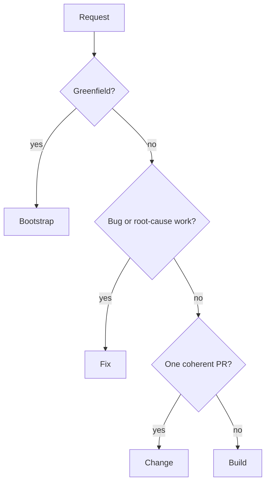

Every repository-changing woostack workflow starts from an explicit user goal. Local run manifests
under `.woostack/tmp/runs/<run-id>/` own current product specifications, increment contracts, and
manifest state for builds and post-diagnosis fixes (with optional Linear or Plane mirroring: `artifacts.provider: "linear"` or
`artifacts.provider: "plane"`). Git and GitHub own implementation and delivery truth. Bootstrap,
change, standalone planning, and other artifact use retain their documented optional boundaries.

## Routing by work shape



Routing is not an approval gate. When scope expands after work begins, the workflow preserves
repository state and reports the handoff. The work then moves through the workflow that matches its
new shape instead of silently changing the contract.

## Bootstrap

```text
gather requirements → research live options → present complete design →
approve design → collision-check target → scaffold → run and verify
```

Bootstrap is greenfield-only. No target write occurs before explicit design approval and a clean
collision check. An exact Linear or Plane project may persist the approved design/plan after approval,
but is not a write barrier or repository authority.

## Build

```text
allocate/resume local run and admit baseline (if mirroring) → local Ideate/Harden →
write `project-spec.md` (and optional bounded mirror sync) → local Plan/Harden →
write `execution-plan.md` (and optional bounded mirror sync) → retain run artifacts →
verified `Stop here`/`Execute`/`Abandon` handoff
```

Build writes plain `project-spec.md` and `execution-plan.md` Markdown files. When `artifacts.provider: "linear"`
or `artifacts.provider: "plane"`, one bounded cycle mirrors Build artifacts to the configured provider (for Linear:
one project, direct increment issues, native dependencies; for Plane: the exact configured project,
one top-level specification work item `[Build] <goal>`, child increment work items with
`parent = <spec-item-UUID>`, `N-1` strict blocking relations, and project-label discovery/unioning
preserving unrelated labels). Its execution plan
orders independently shippable increments, each with at most one PR. Execute processes one increment at a time in ordinal
order within a run; distinct run IDs may execute concurrently only through disjoint branches, worktrees, and
responsibility surfaces. Every build manages one high-level specification and direct increment contracts in its
retained local run manifest.
## Fix

```text
prompt → reproduce → prove root cause → admit writable target and allocate/resume local run →
use the same local plain-artifact and bounded synchronization path as Build →
present the verified `Stop here`/`Execute`/`Abandon` handoff
```

Fix requires root-cause proof before any project or plan creation and never substitutes a symptom patch.
After proof, a canonical local run is allocated or resumed (and when `artifacts.provider: "linear"` or `artifacts.provider: "plane"`, an
exact `--project` is reused or one project is created from validated defaults). An exact source
`--issue` remains source context and is preserved apart from its supported project link; it is not
repurposed as a plan issue. The complete diagnosis and specification live on the local run manifest,
with executor-ready contracts on direct increments and dependencies between them.
Build and Fix obey the shared
[Local run artifact and provider mirror contract](https://github.com/howarewoo/woostack/blob/main/skills/woostack-init/references/artifact-backends.md#minimal-resumable-manifest-schema).
It defines local run store allocation and resume, provider-free drafting, plain Markdown artifact files,
optional bounded mirror synchronization, artifact retention, failure recovery, base-change detection,
and unchanged Execute safety reads.

After both files are written, Build/Fix display the exact run ID, readable artifact paths, stable task
mappings, dependencies, planning parent branch, planning parent tip, and
`/woostack-execute --run <exact-run-id>`. A mirrored project URL/UUID is evidence only, not an
alternate Build/Fix handoff. The body-free handoff Ask offers exactly `Stop here`, `Execute`, and
`Abandon`. Stop here returns the exact resume command without repository or manifest mutation;
Execute invokes normal Execute once in the same session; Abandon records abandonment without dispatch.
Unknown or custom input fails closed and asks again.

The manifest is the canonical local run authority. Optional mirror drift is recorded as mirror failure
and never invalidates local authority. Before root-cause proof, Fix makes no provider call. Standalone
Plan remains outside this path and keeps its direct synchronization and independent read-back unchanged.

## Change

```text
classify → scope → repository preflight → execute → verify → review → hand back
```

Change handles one bounded non-bug enhancement/refactor and has no hard approval gate. It still
requires an explicit goal, one coherent PR boundary, verification, smoke testing, and review. It
never reads or writes an artifact provider.
## Shared execution boundary

Build and Fix prepare approved work for the separately invoked [woostack-execute](/docs/skills/woostack-execute):

1. resolve canonical repository/base and one collision-safe worktree per task;
2. implement with Red → Green → Refactor;
3. run focused verification and the real changed-path smoke test;
4. perform specification review then quality review on the complete uncommitted diff;
5. use [woostack-commit](/docs/skills/woostack-commit) only after the diff passes; and
6. independently read the PR/head/base/check/review result back.

Build/Fix do not execute automatically. The user may choose `Stop here` and invoke Execute later with
the exact command (`/woostack-execute --run <exact-run-id> [--recheck]`), choose `Execute` for one
same-session dispatch, or choose `Abandon` for canonical closure.

## Local run and optional Linear and Plane fix/build paths

```text
build
  → allocate/resume local run in .woostack/tmp/runs/<run-id>/ (admit baseline if mirroring)
  → draft and harden locally with zero provider calls
  → write `project-spec.md` (drift-check, mirror once, and read back if mirroring to Linear or Plane)
  → draft/harden execution plan and write `execution-plan.md` (mirror graph if mirroring)
  → retain all run artifacts in .woostack/tmp/runs/<run-id>/
  → present verified run handoff: Stop here, Execute, or Abandon

fix
  → diagnose and admit the writable target without provider access
  → after proof, allocate/resume local run store and use the same plain-artifact path (optional Linear or Plane mirror)
  → preserve any source issue as context rather than a plan or approval record
  → retain all run artifacts in .woostack/tmp/runs/<run-id>/
  → present verified run handoff: Stop here, Execute, or Abandon
```

The linked artifact contract owns every detail and failure boundary. Artifact-optional workflows
make no provider call unless their own contract explicitly selects provider artifact access.

If a local build/Fix workflow is explicitly abandoned, repository work stops, `status: "abandoned"` is
recorded in the run manifest, and all run artifacts in `.woostack/tmp/runs/<run-id>/` are retained
without mutating a mirrored Linear or Plane project. Standalone Plan closes its existing project as canceled
after independent read-back. A normal handoff, replan, or blocker leaves project status unchanged.
## Terminal outcomes

Every route returns one of:

- verified reviewed PR or reviewed stack;
- approved handoff before implementation;
- truthful blocker with exact safe resume boundary; or
- explicit abandonment preserving recoverable repository evidence, recording `status: "abandoned"`
  in the run manifest, and retaining all run artifacts. For standalone Plan, the exact existing
  project is closed as canceled after independent read-back. Any source issue is preserved apart from
  its supported project link.

No woostack development workflow merges.
