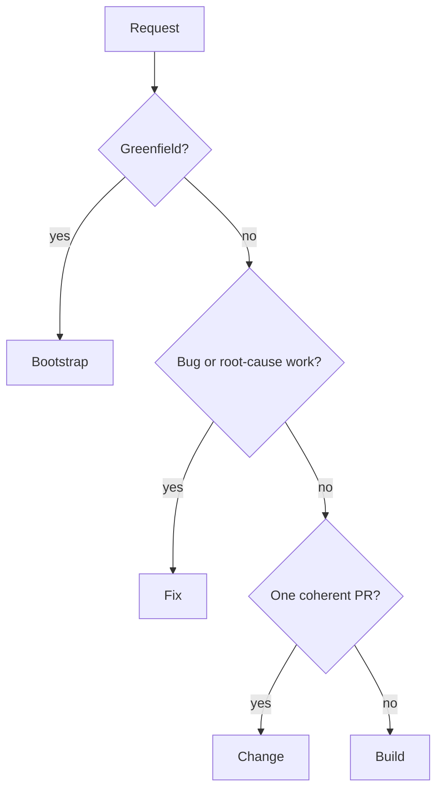

Every repository-changing woostack workflow starts from an explicit user goal and an active workflow
contract. Git and GitHub own implementation truth. Linear records fix/build plans only when
repository policy and authenticated official MCP capability prove it is available.

## Route by work shape



Routing is not an approval gate. If scope expands after work begins, preserve repository state,
report the handoff, and route through the appropriate workflow rather than silently changing the
contract.

## Bootstrap

```text
gather requirements → research live options → present complete design →
approve design → collision-check target → scaffold → run and verify
```

Bootstrap is greenfield-only. No target write occurs before explicit design approval and a clean
collision check. A Linear project may persist the approved design/plan after approval, but is not a
write barrier or repository authority.

## Build

```text
ideate → approve design → harden specification → approve specification →
plan → harden increments → persist available Linear plan →
approve execution → execute → review → hand back
```

Build owns exactly three gates. Its approved plan orders independently shippable increments, each
with at most one PR. Dependency-independent disjoint increments may execute concurrently in
separate worktrees. When Linear is available, one project contains a parent plan issue with one
native child issue per increment.

## Fix

```text
classify → reproduce → prove root cause → harden fix contract →
approve → persist available Linear plan → execute → review → hand back
```

Fix has one explicit approve-to-execute gate. It never substitutes a symptom patch for root-cause
proof. When Linear is available, one project stores the diagnosis, parent fix plan issue, and its
single increment child. No Linear capability is needed to diagnose or deliver the fix.

## Change

```text
classify → scope → repository preflight → execute → verify → review → hand back
```

Change handles one bounded non-bug enhancement/refactor and has no hard approval gate. It still
requires an explicit goal, one coherent PR boundary, verification, smoke testing, and review. It
never reads or writes Linear.

## Shared execution boundary

Build, Fix, and Change hand approved work to [woostack-execute](/docs/skills/woostack-execute):

1. resolve canonical repository/base and one collision-safe worktree per task;
2. implement with Red → Green → Refactor;
3. run focused verification and the real changed-path smoke test;
4. perform specification review then quality review on the complete uncommitted diff;
5. use [woostack-commit](/docs/skills/woostack-commit) only after the diff passes; and
6. independently read the PR/head/base/check/review result back.

[woostack-execute-overnight](/docs/skills/woostack-execute-overnight) replaces only human stop
points. It does not weaken scope, verification, review, collision, or merge boundaries.

## Linear plan branch

```text
fix/build/plan sees validated repository linear policy
  → preflight official authenticated MCP capability without reading credentials
  → unavailable or incomplete: remain artifact-free
  → available: create/reconcile one project and parent plan issue
  → create/reconcile one native child issue per increment
  → persist native dependency relations
  → independently read every write and hierarchy edge back
  → execution handoff
```

Exact caller-supplied resources and explicit persistence requests still bypass automatic creation.
`woostack-change` has no Linear branch. A failure after automatic availability was proved blocks the
plan deliverable at the last verified artifact boundary.

If a fix or build is explicitly abandoned at execution handoff or at any other time, repository work
stops and any existing plan project moves to the configured canceled status. The workflow reads that
transition back before claiming closure. It does not create a project merely to cancel it, and a
normal handoff, replan, or blocker leaves the project open.

## Terminal outcomes

Every route returns one of:

- verified reviewed PR or reviewed stack;
- approved handoff before implementation;
- truthful blocker with exact safe resume boundary; or
- explicit abandonment preserving recoverable repository evidence and closing any existing
  fix/build project as canceled.

No woostack development workflow merges.
