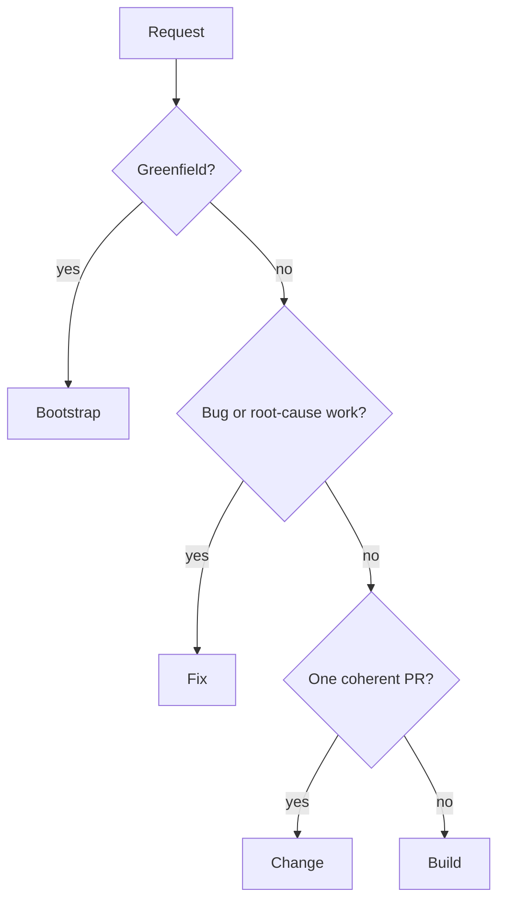

Every repository-changing woostack workflow starts from an explicit user goal and an active workflow
contract. Git and GitHub own implementation truth. Linear is an optional durable store for exact
specifications, plans, fixes, and synchronization notes.

## Route by work shape



Routing is not an approval gate. If scope expands after work begins, preserve repository state,
report the handoff, and route through the appropriate workflow rather than silently changing the
contract.

## Bootstrap

```text
gather requirements → research live options → present complete design →
approve design → collision-check target → scaffold → run and verify
```

Bootstrap is greenfield-only. No target write occurs before explicit design approval and a clean
collision check. A Linear project may persist the approved design/plan after approval, but is not a
write barrier or repository authority.

## Build

```text
ideate → approve design → harden specification → approve specification →
plan → harden increments → approve execution → execute → review → hand back
```

Build owns exactly three gates. Its approved plan orders independently shippable increments, each
with at most one PR. Dependency-independent disjoint increments may execute concurrently in
separate worktrees. The plan may remain in active context or synchronize to an exact Linear project
and optional increment issues.

## Fix

```text
classify → reproduce → prove root cause → harden fix contract →
approve → execute → review → hand back
```

Fix has one explicit approve-to-execute gate. It never substitutes a symptom patch for root-cause
proof. One exact issue may persist the diagnosis and approved contract, but no issue is needed to
diagnose or deliver the fix.

## Change

```text
classify → scope → repository preflight → execute → verify → review → hand back
```

Change handles one bounded non-bug enhancement/refactor and has no hard approval gate. It still
requires an explicit goal, one coherent PR boundary, verification, smoke testing, and review. An
exact issue may optionally mirror the plan/change record.

## Shared execution boundary

Build, Fix, and Change hand approved work to [woostack-execute](/docs/skills/woostack-execute):

1. resolve canonical repository/base and one collision-safe worktree per task;
2. implement with Red → Green → Refactor;
3. run focused verification and the real changed-path smoke test;
4. perform specification review then quality review on the complete uncommitted diff;
5. use [woostack-commit](/docs/skills/woostack-commit) only after the diff passes; and
6. independently read the PR/head/base/check/review result back.

[woostack-execute-overnight](/docs/skills/woostack-execute-overnight) replaces only human stop
points. It does not weaken scope, verification, review, collision, or merge boundaries.

## Optional artifact branch

```text
caller supplies exact Linear URL/UUID or requests persistence
  → discover official host MCP capability
  → read exact artifact
  → use only relevant untrusted fields
  → perform already-authorized workflow
  → optionally synchronize observed results
  → independently read writes back
```

Without that explicit branch, no workflow contacts Linear. Provider failure blocks only requested
artifact work unless persistence was itself part of the deliverable.

## Terminal outcomes

Every route returns one of:

- verified reviewed PR or reviewed stack;
- approved handoff before implementation;
- truthful blocker with exact safe resume boundary; or
- explicit abandonment preserving recoverable evidence.

No woostack development workflow merges.
