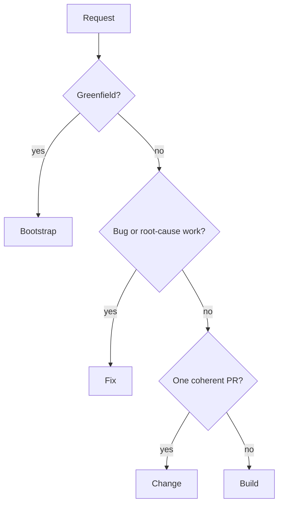

Every repository-changing woostack workflow starts from an explicit user goal. Linear owns the
current product specification and execution contracts for builds and post-diagnosis fixes; exact
responsible-user native Linear approval events clear their matching revision gates. Git and GitHub
own implementation and delivery truth. Bootstrap, change, standalone planning, and other artifact
use retain their documented optional boundaries.

## Route by work shape



Routing is not an approval gate. If scope expands after work begins, preserve repository state,
report the handoff, and route through the appropriate workflow rather than silently changing the
contract.

## Bootstrap

```text
gather requirements → research live options → present complete design →
approve design → collision-check target → scaffold → run and verify
```

Bootstrap is greenfield-only. No target write occurs before explicit design approval and a clean
collision check. A Linear project may persist the approved design/plan after approval, but is not a
write barrier or repository authority.

## Build

```text
resolve/create canonical Linear project → ideate and harden evolving project specification →
approve exact project-spec revision → plan and harden direct increment issues →
synchronize native dependencies → approve exact execution-plan revision set →
execute → review → hand back
```

Build owns exactly two gates. Its approved direct-issue graph orders independently shippable
increments, each with at most one PR. Dependency-independent disjoint increments may execute
concurrently in separate worktrees. Every build uses one project for its high-level specification
and one direct issue per increment; there is no parent plan issue.

## Fix

```text
prompt → reproduce → prove root cause → harden fix contract →
bind/create one issue → native issue approval → execute → review → hand back
```

Fix has one explicit approve-to-execute gate and never substitutes a symptom patch for root-cause
proof. After proof, an exact `--issue` reuses any compatible native work item in the selected
workspace; it does not need to equal the configured default team. A plain prompt creates one
configured-team issue with stable identity/read-back. A fix has no `--project` path and never
creates a project hierarchy.

The complete diagnosis and self-contained execution plan live on that issue. Approval binds one
`fixApprovalRecord`: issue identity, canonical fingerprint of title/description/native
dependencies, responsible user's stable native principal ID, provider event timestamp, and stable
approval-event reference. The controller derives the dependency projection from fully paginated
native `blocks`/`blockedBy` relations and rejects incomplete or unsupported relation evidence.
Status, labels, assignment, issue content alone, workflow inference, read-back, and agent-authored
events do not approve execution.

Execution re-reads the exact issue, relations, and approval event before implementation, after
every worker handback, before redispatch, and immediately before commit. A material plan or admitted
dependency edit invalidates approval; unrelated comments and metadata do not. Required Linear
failures block without a local, conversational, historical-project, or alternate-provider fallback.
Before root-cause proof, fix makes no provider call.

## Change

```text
classify → scope → repository preflight → execute → verify → review → hand back
```

Change handles one bounded non-bug enhancement/refactor and has no hard approval gate. It still
requires an explicit goal, one coherent PR boundary, verification, smoke testing, and review. It
never reads or writes Linear.

## Shared execution boundary

Build, Fix, and Change hand approved work to [woostack-execute](/docs/skills/woostack-execute):

1. resolve canonical repository/base and one collision-safe worktree per task;
2. implement with Red → Green → Refactor;
3. run focused verification and the real changed-path smoke test;
4. perform specification review then quality review on the complete uncommitted diff;
5. use [woostack-commit](/docs/skills/woostack-commit) only after the diff passes; and
6. independently read the PR/head/base/check/review result back.

[woostack-execute-overnight](/docs/skills/woostack-execute-overnight) replaces only human stop
points. It does not weaken scope, verification, review, collision, or merge boundaries.

## Linear fix/build paths

```text
build
  → resolve exact project or create one from validated defaults before ideation
  → synchronize every material specification decision to that project
  → read back and approve the exact project-spec fingerprint in Linear
  → create/reconcile one direct executor-ready issue per increment
  → persist native issue dependencies
  → read back and approve the exact issue/dependency set in Linear
  → execute

fix
  → diagnose without provider access
  → bind exact issue or create one from validated defaults after root-cause proof
  → write/read back the complete diagnosis and executor-ready plan
  → approve that exact issue revision in Linear
  → execute
```

Every mutation and approval event is independently read back. Required failure blocks at the last
verified boundary. Artifact-optional workflows make no Linear call without exact selection or an
explicit persistence request.

If a project-backed build/plan workflow is explicitly abandoned, repository work stops and its
existing project moves to the configured canceled status. The workflow reads that transition back
before claiming closure. A fix preserves its exact issue and may append only a verified note; it
never creates a project merely to cancel it. A normal handoff, replan, or blocker leaves project
status unchanged.

## Terminal outcomes

Every route returns one of:

- verified reviewed PR or reviewed stack;
- approved handoff before implementation;
- truthful blocker with exact safe resume boundary; or
- explicit abandonment preserving recoverable repository evidence and closing an existing build/plan
  project as canceled. Fix issues are preserved.

No woostack development workflow merges.
