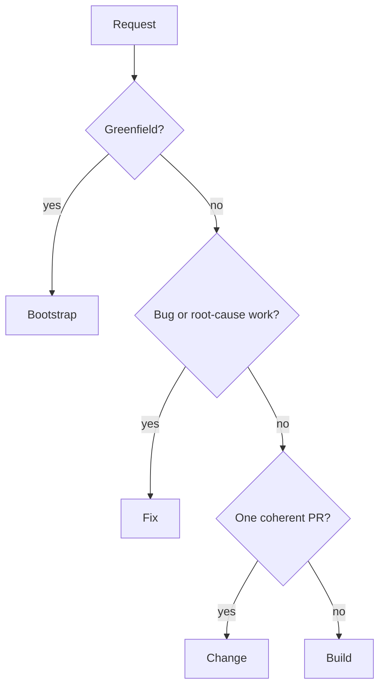

Every repository-changing woostack workflow starts from an explicit user goal. Linear owns the
current product specification and execution contracts for builds and post-diagnosis fixes; exact
responsible-user native Linear approval events clear their matching revision gates. Git and GitHub
own implementation and delivery truth. Bootstrap, change, standalone planning, and other artifact
use retain their documented optional boundaries.

## Route by work shape



Routing is not an approval gate. If scope expands after work begins, preserve repository state,
report the handoff, and route through the appropriate workflow rather than silently changing the
contract.

## Bootstrap

```text
gather requirements → research live options → present complete design →
approve design → collision-check target → scaffold → run and verify
```

Bootstrap is greenfield-only. No target write occurs before explicit design approval and a clean
collision check. A Linear project may persist the approved design/plan after approval, but is not a
write barrier or repository authority.

## Build

```text
resolve/create project and admit exact baseline → local Ideate/Harden →
render and approve owner-only `project-spec.md` path/hash/length identity →
bounded save/read-back/receipt → local Plan/Harden →
render and approve owner-only `execution-plan.md` path/hash/length identity plus concise mapping →
bounded save/read-back/receipt → execute → review → hand back
```

Build owns exactly two gates. Its approved direct-issue graph orders independently shippable
increments, each with at most one PR. Dependency-independent disjoint increments may execute
concurrently in separate worktrees. Every build uses one project for its high-level specification
and one direct issue per increment; there is no parent plan issue.

## Fix

```text
prompt → reproduce → prove root cause → admit writable target and canonical project →
use the same local two-gate drafting and bounded synchronization path as Build →
execute → review → hand back
```

Fix owns the same two project-backed approval gates as Build and never substitutes a symptom patch
for root-cause proof. After proof, an exact `--project` is reused or one project is created from
validated defaults. An exact source `--issue` remains source context and is preserved apart from its
supported project link; it is not repurposed as a plan issue. The complete diagnosis and
specification live on the canonical project, with executor-ready contracts on direct issues and
native dependencies between them.

Build and Fix obey the shared
[Linear artifact contract](https://github.com/howarewoo/woostack/blob/main/skills/woostack-init/references/artifact-backends.md#run-scoped-gated-draft-manifest).
It defines exact baseline admission, provider-free gated drafting, deterministic owner-only gate
files, path/hash/length/fingerprint-version approval identity, approval-before-save, native
read-back compared by the shared provider-presentation canonical fingerprint before receipt, stable
identity mapping, failure recovery, cleanup, and unchanged Execute rechecks.

The temporary local draft never replaces the last Linear-approved boundary. Material project drift
invalidates both records; issue or dependency drift invalidates only the execution-plan record.
Before root-cause proof, Fix makes no provider call. Standalone Plan remains outside this gated path
and keeps its direct synchronization and independent read-back unchanged.

## Change

```text
classify → scope → repository preflight → execute → verify → review → hand back
```

Change handles one bounded non-bug enhancement/refactor and has no hard approval gate. It still
requires an explicit goal, one coherent PR boundary, verification, smoke testing, and review. It
never reads or writes Linear.

## Shared execution boundary

Build, Fix, and Change hand approved work to [woostack-execute](/docs/skills/woostack-execute):

1. resolve canonical repository/base and one collision-safe worktree per task;
2. implement with Red → Green → Refactor;
3. run focused verification and the real changed-path smoke test;
4. perform specification review then quality review on the complete uncommitted diff;
5. use [woostack-commit](/docs/skills/woostack-commit) only after the diff passes; and
6. independently read the PR/head/base/check/review result back.

[woostack-execute-overnight](/docs/skills/woostack-execute-overnight) replaces only human stop
points. It does not weaken scope, verification, review, collision, or merge boundaries.

## Linear fix/build paths

```text
build
  → resolve/create one exact project and admit gate 1 baseline
  → draft and harden locally with zero provider calls
  → render and approve owner-only `project-spec.md` path/hash/length identity
  → drift-check, synchronize once, read content back, then record/read the receipt
  → repeat the local draft/render/approve/sync/read-back/receipt order for `execution-plan.md`
  → clean up both gate files and the run manifest, then execute

fix
  → diagnose and admit the writable target without provider access
  → after proof, resolve/create the exact project and use the same two-gate file order
  → preserve any source issue as context rather than a plan or approval record
  → clean up both gate files and the run manifest, then execute
```

The linked artifact contract owns every detail and failure boundary. Artifact-optional workflows
make no Linear call without exact selection or an explicit persistence request.

If a project-backed build/plan/Fix workflow is explicitly abandoned, repository work stops and its
exact existing canonical project moves to the configured canceled status. The workflow reads that
transition back before claiming closure. Any source issue remains preserved apart from its supported
project link. A normal handoff, replan, or blocker leaves project status unchanged.

## Terminal outcomes

Every route returns one of:

- verified reviewed PR or reviewed stack;
- approved handoff before implementation;
- truthful blocker with exact safe resume boundary; or
- explicit abandonment preserving recoverable repository evidence and closing the exact existing
  build/plan/Fix project as canceled after independent read-back. Any source issue is preserved
  apart from its supported project link.

No woostack development workflow merges.
